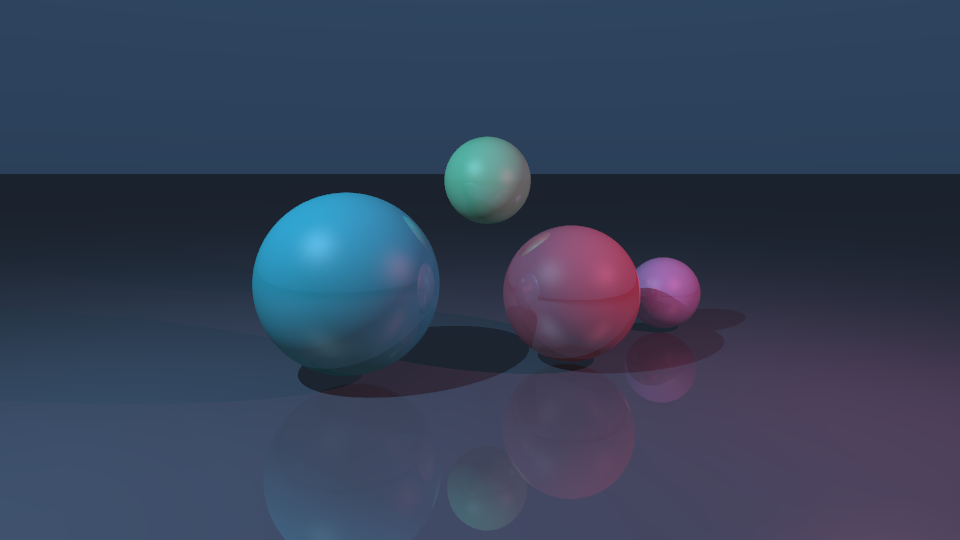
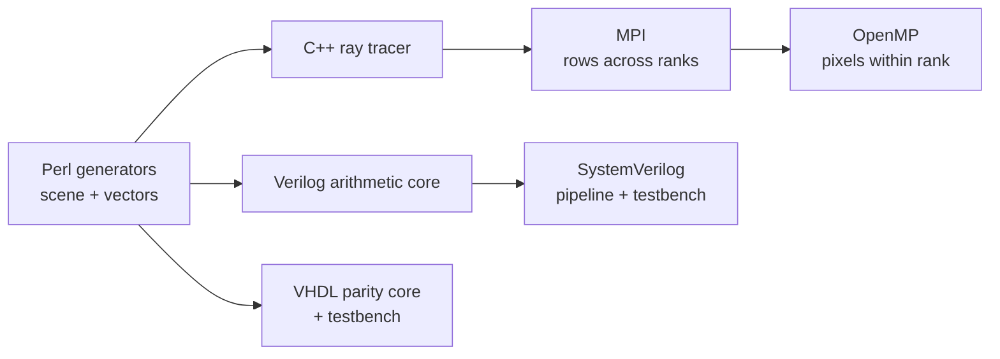

<p align="center">
  <h1 align="center">PrismForge</h1>
  <p align="center"><strong>Hybrid distributed ray tracing + RTL accelerator co-design</strong></p>
</p>

<p align="center">
  
  
  
  
  
  
</p>

<p align="center">
  
</p>

PrismForge is a small hardware/software co-design laboratory built around a real ray tracer. MPI partitions image rows across processes, OpenMP schedules pixels inside each process, and the RTL directory explores fixed-point ray–sphere intersection as an accelerator candidate. Perl closes the loop by generating deterministic scenes and shared verification vectors for both HDL implementations.

The image above was rendered by the checked-in C++ code—not supplied as a mockup.

## Why these technologies belong together



| Layer | Responsibility |
|---|---|
| C++17 | Camera rays, sphere/plane intersections, shadows, Blinn–Phong highlights, recursive reflection, PPM output |
| MPI | Gives rank `r` rows `r, r + world_size, …`; combines sparse rank-local framebuffers with `MPI_Reduce` |
| OpenMP | Dynamically schedules each rank’s assigned rows across its CPU threads |
| Verilog | Combinational Q8.8 ray–sphere discriminant and forward-ray predicate |
| SystemVerilog | Two-cycle valid/data pipeline and self-checking vector testbench |
| VHDL | Independent implementation of the same arithmetic contract for cross-language parity |
| Perl | Deterministic scene generation, randomized RTL vectors, and benchmark-table reporting |

## Run the renderer

### Local OpenMP build

```bash
make local
./build/prismforge \
  --width 960 --height 540 --samples 4 --threads 8 \
  --scene scenes/neon.scene --output render.ppm
```

### Hybrid MPI + OpenMP build

```bash
make mpi
mpirun -np 4 ./build/prismforge-mpi \
  --width 1920 --height 1080 --samples 8 --threads 4 \
  --scene scenes/neon.scene --output render.ppm
```

Every MPI rank owns an interleaved set of rows, avoiding a central work queue. OpenMP uses dynamic row scheduling because reflective pixels do more work than background pixels. Each rank keeps a sparse full-sized framebuffer; one reduction assembles the final image on rank 0.

## Run the hardware verification

```bash
# Generates one scene and 128 shared reference vectors with Perl
make generate

# Icarus Verilog: Verilog core + SystemVerilog pipeline/testbench
make rtl-verilog

# GHDL: independent VHDL core/testbench against the same vectors
make rtl-vhdl
```

The shared fixed-point predicate is:

$$\Delta = \left(oc \cdot d\right)^2 - \left(d \cdot d\right)\left(oc \cdot oc-r^2\right)$$

A hit requires $\Delta \ge 0$ and a forward intersection. Details, widths, and the exact current hardware boundary are documented in [docs/hardware.md](docs/hardware.md).


### Verilator cycle-accurate C++ model

PrismForge also compiles the same SystemVerilog pipeline into a native C++ model with Verilator:

```bash
make rtl-verilator
```

That target generates fresh fixed-point vectors, Verilates `ray_packet_pipeline.sv`, builds the generated `Vray_packet_pipeline` C++ model with a handwritten harness, clocks reset/valid/data cycle by cycle, and checks every output against the shared vectors. This is a genuinely executable C++ hardware model rather than another HDL-only testbench.

## Reproduce everything

```bash
docker build -t prismforge .
mkdir -p out
docker run --rm -v "$PWD/out:/output" prismforge
```

GitHub Actions independently builds the OpenMP and MPI paths, executes a two-rank render, generates fresh Perl vectors, and runs both HDL testbenches.

## Repository map

```text
include/prismforge/       vector math, scene model, runtime interfaces
src/                      renderer, parser, MPI/OpenMP runtime
rtl/verilog/              synthesizable intersection arithmetic
rtl/systemverilog/        valid/data pipeline and self-checking testbench
rtl/vhdl/                 parity implementation and testbench
tools/                    Perl generators and scaling-report formatter
scenes/                   human-readable render inputs
tests/                    dependency-free C++ correctness checks
```

## What this project does—and does not—claim

The CPU renderer, scene generator, distributed decomposition, and RTL simulations are implemented. The Verilog and VHDL blocks currently accelerate and verify the **intersection predicate only**. They are not yet connected to the MPI renderer through PCIe, AXI, or a physical FPGA, and this repository does not claim synthesis timing or hardware speedup.

That separation is deliberate: it provides a testable arithmetic contract before committing to a device-specific transport layer.

## Development history

The repository is intentionally organized as focused commits:

1. Correct deterministic ray-tracing core
2. MPI/OpenMP hybrid execution
3. Verilog arithmetic + SystemVerilog pipeline
4. VHDL parity + Perl generation
5. CI, reproducible tooling, and documentation

---

Built by [Neha Mahesh](https://github.com/mneha05) as an exploration of parallel rendering, digital design, and hardware/software co-design.
